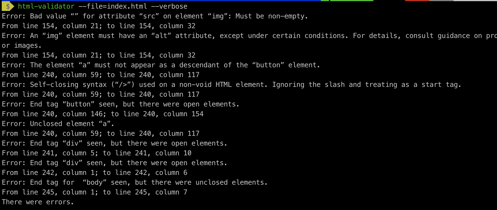

# WebEngineering Module, Graded Exercise

## Commit Proposal

Matriculation Number: 17-548-397

Project idea short description: 
Platform for control of orders in restaurant
Expectations: 1 page for create new orders or modify orders which have not been
canceled yet (consumer is still in the restaurant) and 1 page with the day overview
(all orders of one specified date).

## Project confirmation

Either you put _create_, _edit_ and _delete_ on one single page (aka single-page app, with some **JavaScript**). Or you will need one page for each operation. You might start. Good luck!

## Project delivery <to be filled by student>

How to start the project: (if other than `grailsw run-app`)

How to test the project:  (if other than `grailsw test-app`)

Hand-written, static HTML 
project description: is located at `src/main/resources/public/index.html`. Basically, could be reached at http://localhost:8010/index.html
when the application has started.

External contributions:

Other comments: 

I'm particular proud of:

## Project grading 

Very complete project description found at http://localhost:8010/index.html (I had to start the application).
It looks good and contains some _semantic_ elements. Unfortunately, it is invalid:

Application runs without any problems. Default server port changed to `8010`.

#### Features

* **Spring Security**
* 4 + 3 (security based) domain models
* Navigation, input validation

#### Engineering

* Good commit log
* Some unit tests (no integration tests) are provided
* All other aspects are fine

Overall this is an useful application. And you did it on your own, in a quite short period of time.
There is room for improvement. By spending more time on it, you could definitely make something ready for production.

Congratulations!

Grade: **5.9**